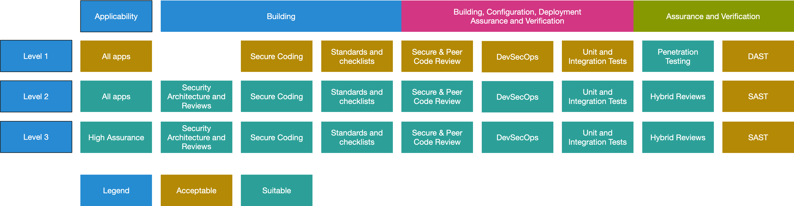

# Usando ASVS

ASVS tiene dos objetivos principales:

* Ayudar a las organizaciones a desarrollar y mantener aplicaciones seguras.
* Permitir que los proveedores de servicios de seguridad, los proveedores de herramientas de seguridad y los consumidores alineen sus requisitos y ofertas.

## Niveles de ASVS

El estándar de verificación de seguridad de aplicaciones define tres niveles de verificación de seguridad, con cada nivel aumentando en profundidad.

* ASVS Nivel 1 es para bajos niveles de garantía, y es completamente comprobable con pentesting.
* ASVS Nivel 2 es para aplicaciones que contienen datos confidenciales, que requiere protección y es el nivel recomendado para la mayoría de las aplicaciones.
* ASVS Nivel 3 es para las aplicaciones más críticas - aplicaciones que realizan transacciones de alto valor, contienen datos médicos sensibles, o cualquier aplicación que requiere el más alto nivel de confianza.

Cada nivel ASVS contiene una lista de requisitos de seguridad. Cada uno de estos requisitos también se puede asignar a características y capacidades específicas de seguridad que los desarrolladores deben integrar en el software.

Figura 1 - Niveles de OWASP ASVS 4.0

El nivel 1 (L1) es el único nivel que es completamente comprobable de penetración usando humanos. Todos los demás requieren acceso a la documentación, el código fuente, la configuración y las personas involucradas en el proceso de desarrollo. Sin embargo, incluso si L1 permite que se realicen pruebas de "caja negra" (sin documentación ni fuente), no es una actividad de garantía eficaz y debe desalentarse activamente. Los atacantes malintencionados tienen mucho tiempo, la mayoría de las pruebas de penetración han terminado en un par de semanas. Los defensores necesitan crear controles de seguridad, proteger, encontrar y resolver todas las debilidades, y detectar y responder a actores malintencionados en un tiempo razonable. Los actores malintencionados tienen tiempo esencialmente infinito y sólo necesitan una defensa porosa, una sola debilidad, o falta de detección para tener éxito. Las pruebas de caja negra, que a menudo se realizan al final del desarrollo, se realizan rápidamente, y son completamente incapaces de hacer frente a esa asimetría.

Durante los últimos 30+ años, las pruebas de cajas negras han demostrado una y otra vez perderse problemas críticos de seguridad que llevaron directamente a brechas cada vez más masivas. Recomendamos encarecidamente el uso de una amplia gama de garantías y verificación de seguridad, incluida la sustitución de pruebas de penetración por pruebas de penetración dirigidas por código fuente (híbrido) en el nivel 1, con acceso completo a los desarrolladores y documentación durante todo el proceso de desarrollo. Los reguladores financieros no toleran auditorías financieras externas sin acceso a los libros, transacciones de muestra o a las personas que realizan los controles. La industria y los gobiernos deben exigir el mismo estándar de transparencia en el campo de la ingeniería de software.

Recomendamos encarecidamente el uso de herramientas de seguridad dentro del proceso de desarrollo. Las herramientas DAST y SAST se pueden utilizar continuamente por el canal de construcción para detectar problemas de seguridad fáciles de encontrar que nunca deben estar presentes.

Las herramientas automatizadas y los escaneos en línea sólo pueden completar casi la mitad del ASVS sin asistencia humana. Si se requiere una automatización de pruebas completa para cada compilación, se usa una combinación de pruebas de unidad personalizadas e integración, junto con escaneos en línea iniciados por la compilación. Los defectos de lógica empresarial y las pruebas de control de acceso solo son posibles mediante la asistencia humana. Estos deben convertirse en pruebas unitarias y de integración.

## Cómo usar este estándar

Una de las mejores maneras de utilizar el estándar de verificación de seguridad en aplicaciones es usarlo como un plano-guía para crear una lista de comprobación de codificación segura específica para su aplicación, plataforma u organización. Adaptar el ASVS a sus casos de uso aumentará el enfoque en los requisitos de seguridad que son más importantes para sus proyectos y entornos.

### Nivel 1 (L1) - Primeros pasos, vista automatizada o completa de la cartera

Una aplicación alcanza ASVS Nivel 1 si logra defenderse contra vulnerabilidades de seguridad de aplicaciones que son fáciles de descubrir, e incluido el Top 10 de OWASP y otras listas de comprobación similares.

El nivel 1 es el mínimo por el que todas las aplicaciones deben esforzarse. También es útil como primer paso en un esfuerzo multifáses o cuando las aplicaciones no almacenan ni manejan datos confidenciales y, por lo tanto, no necesitan los controles más rigurosos de Nivel 2 o 3. Los controles de nivel 1 se pueden comprobar automáticamente mediante herramientas o simplemente manualmente sin acceso al código fuente. Consideramos el Nivel 1 el mínimo requerido para todas las aplicaciones.

Las amenazas a la aplicación probablemente serán de atacantes que utilizan técnicas simples y de bajo esfuerzo para identificar vulnerabilidades fáciles de encontrar y fáciles de explotar. Esto contrasta con un atacante determinado que gastará energía enfocada para apuntar específicamente a la aplicación. Si los datos procesados por su aplicación tienen un alto valor, rara vez querrá detenerse en una revisión de Nivel 1.

### Nivel 2 (L2) - Para la mayoría de las aplicaciones

Una aplicación alcanza ASVS Nivel 2 (o Estándar) si se defiende adecuadamente contra la mayoría de los riesgos asociados con el software hoy en día.

El nivel 2 garantiza que los controles de seguridad estén en su lugar, sean eficaces y se utilicen dentro de la aplicación. El nivel 2 suele ser adecuado para aplicaciones que manejan importantes transacciones de negocio-a-negocio, incluidas aquellas que procesan información de atención médica, y/o implementan funciones críticas para el negocio, o procesan otros activos sensibles, o industrias donde la integridad es una faceta crítica para proteger su negocio, como la industria de juegos para frustrar a los tramposos y game hacks.

Las amenazas a las aplicaciones de nivel 2 suelen ser atacantes calificados y motivados que se centran en objetivos específicos utilizando herramientas y técnicas, que son altamente practicadas y eficaces para descubrir y explotar las debilidades dentro de las aplicaciones.

### Nivel 3 (L3) - Alto valor, alta garantía o alta seguridad

ASVS Nivel 3 es el nivel más alto de verificación dentro del ASVS. Este nivel se reserva normalmente para aplicaciones que requieren niveles significativos de verificación de seguridad, como los que se pueden encontrar dentro de áreas de militar, salud y seguridad, infraestructura crítica, etc.

Las organizaciones pueden requerir ASVS Nivel 3 para aplicaciones que realizan funciones críticas, donde el error podría afectar significativamente las operaciones de la organización, e incluso su supervivencia. A continuación se proporcionan instrucciones de ejemplo sobre la aplicación del nivel 3 de ASVS. Una aplicación alcanza ASVS Nivel 3 (o Avanzado) si se defiende adecuadamente contra vulnerabilidades avanzadas de seguridad de aplicaciones y también demuestra principios de buen diseño de seguridad.

Una aplicación en ASVS Nivel 3 requiere un análisis más detallado de la arquitectura, la codificación y las pruebas que todos los demás niveles. Una aplicación segura se modulariza de una manera significativa (para facilitar la resiliencia, la escalabilidad y, sobre todo, las capas de seguridad), y cada módulo (separado por conexión de red y/o instancia física) se encarga de sus propias responsabilidades de seguridad (defensa en profundidad), que deben documentarse correctamente. Las responsabilidades incluyen controles para garantizar la confidencialidad (por ejemplo, cifrado), integridad (por ejemplo, transacciones, validación de entradas), disponibilidad (por ejemplo, manejo correcto de la carga), autenticación (incluidos entre sistemas), autorización y auditoría (registros de log).

## Aplicando ASVS en la Práctica

Diferentes amenazas tienen diferentes motivaciones. Algunas industrias tienen activos únicos de información y tecnología y requisitos de cumplimiento normativo específicos del dominio.

Se recomienda encarecidamente a las organizaciones que examinen profundamente sus características de riesgo únicas en función de la naturaleza de su negocio, y sobre la base de que los requisitos de riesgo y de negocio determinan el nivel adecuado de ASVS.

## Cómo Hacer Referencia a los Requisitos de ASVS

Cada requisito tiene un identificador en el formato `<chapter>.<section>.<requirement>` donde cada elemento es un número, por ejemplo: `1.11.3`.
- El elemento `<chapter>` corresponde al capítulo del que proviene el requisito, por ejemplo: todos los requisitos de `1.#.#` son del capítulo de `Arquitectura`.
- El elemento `<section>` corresponde a la sección dentro de ese capítulo donde aparece el requisito, por ejemplo: todos los requisitos de `1.11.#` están en la sección `Arquitectura de la Lógica del Negocio`, del capítulo de `Arquitectura`.
- El elemento `<requirement>` identifica el requisito específico dentro del capítulo y la sección, por ejemplo: `1.11.3` que a partir de la versión 4.0.3 del presente estándar es:

> Compruebe que todos los flujos de lógica de negocio de alto valor, incluida la autenticación, la administración de sesiones y el control de acceso, sean seguros para subprocesos y resistentes a las condiciones de tiempo de comprobación y tiempo de uso.

Los identificadores pueden cambiar entre las versiones de la norma, por lo que es preferible que otros documentos, informes o herramientas utilicen el formato: `v<version>-<chapter>.<section>.<requirement>`, donde: 'versión' es la etiqueta de la versión ASVS. Por ejemplo: `v4.0.3-1.11.3` se entendería que significa específicamente el 3er requisito en la sección "Arquitectura de la Lógica del Negocio" del capítulo "Arquitectura" de la versión 4.0.3. (Esto podría resumirse como `v<version>-<requirement_identifier>`)

Nota: La `v` que precede a la parte de la versión debe estar en minúsculas.

Si se utilizan identificadores sin incluir el `v<version>`, se debe suponer que hacen referencia al contenido más reciente del estándar de verificación de seguridad en aplicaciones. Obviamente, a medida que el estándar crece y cambia esto se vuelve problemático, por lo que los escritores o desarrolladores deben incluir el elemento de versión.

Las listas de requisitos de ASVS están disponibles en CSV, JSON y otros formatos que pueden ser útiles para el uso de referencia o mediante programación.
