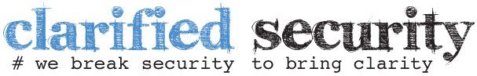
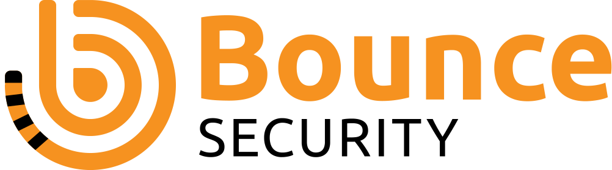
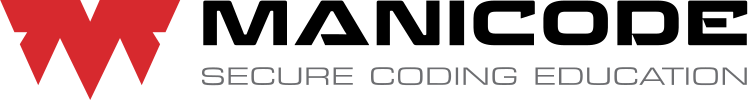
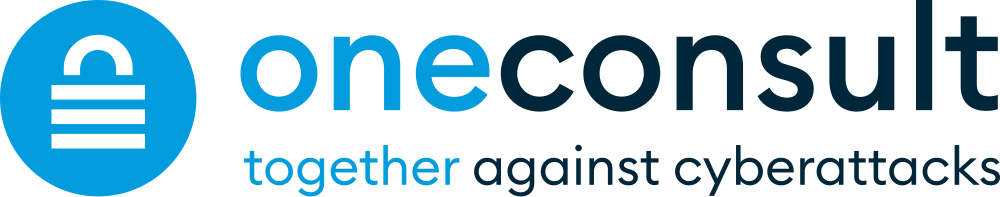
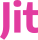
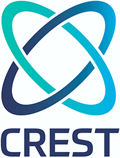

# ASVS Supporters

<!--Don't forget to update https://github.com/OWASP/ASVS/issues/1888 -->
<!--Don't forget to update https://docs.google.com/spreadsheets/d/1OrbrYy6R4ux_BuE2rJ17jQurBYbGz4bwAPJWFK4opew/edit#gid=0-->

## Introduction

Within the ASVS project, we gratefully recognise the following organizations who support the OWASP Application Security Verification Standard project through monetary donations or allowing contributors to spend significant time working on the standard as part of their work with the organization.

We recognise various tiers of support and the amount of time the supporter is recognised for depends on the supporter level.

On this page and the project web page, we will display the supporter's logo and link to their website and we will publicise via Social Media as well.

If you would like to directly become a Primary, Secondary or Tertiary supporter, you can make a [donation to OWASP](https://owasp.org/donate/) of $1,000 or more and choose to "restrict your gift". Alternatively, when you pay your corporate membership you can choose to [allocate part of your membership fee to the ASVS](https://owasp.org/supporters/benefits#corporate-sponsorship-of-participating-projects-or-chapters) where the allocated amount will govern which level of supporter you become.

## Maintaining Supporters (through time provision)

Organizations who have allowed contributors to spend significant time working on the standard as part of their working day with the organization. This will be evaluated at the sole discretion of the project leaders. Supporter will be listed 2 years from the end of the time provision.

## Primary supporters

Organizations who have donated $7,000 or more to the project via OWASP. Supporter will be listed in this section for 3 years from the date of the donation.
<!--95-->

## Secondary supporters

Organizations who have donated $3,000 or more to the project via OWASP. Supporter will be listed in this section for 2 years from the date of the donation.
<!--80-->
## Tertiary supporters

Organizations who have donated $500 or more to the project via OWASP. Supporter will be listed in this section for 1 year from the date of the donation.
<!--65-->

<!--[

## Associate supporters 

Organizations who have donated another amount to the project via OWASP. Supporter will be listed in this section for 1 year from the date of the donation.
<!--50-->

<!--[

<!--Don't forget to update https://github.com/OWASP/ASVS/issues/1888 -->
<!--Don't forget to update https://docs.google.com/spreadsheets/d/1OrbrYy6R4ux_BuE2rJ17jQurBYbGz4bwAPJWFK4opew/edit#gid=0-->
